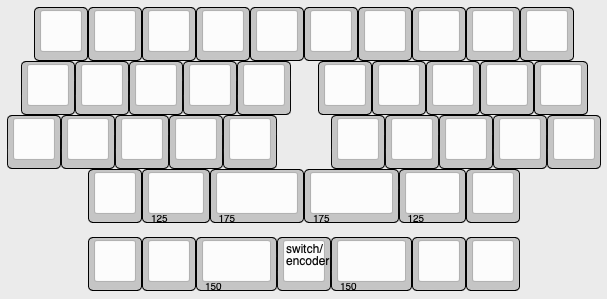

# vault35_katana

Katana stagger version of Cain's Vault35 keyboard

## PCB

### Layout Options

Two bottom row options:
- dual 1.75u, or
- dual 1.5u separated by switch or rotary encoder

# Credits

- projectcain https://github.com/projectcain/Board-Firmware/tree/main/vault35 
